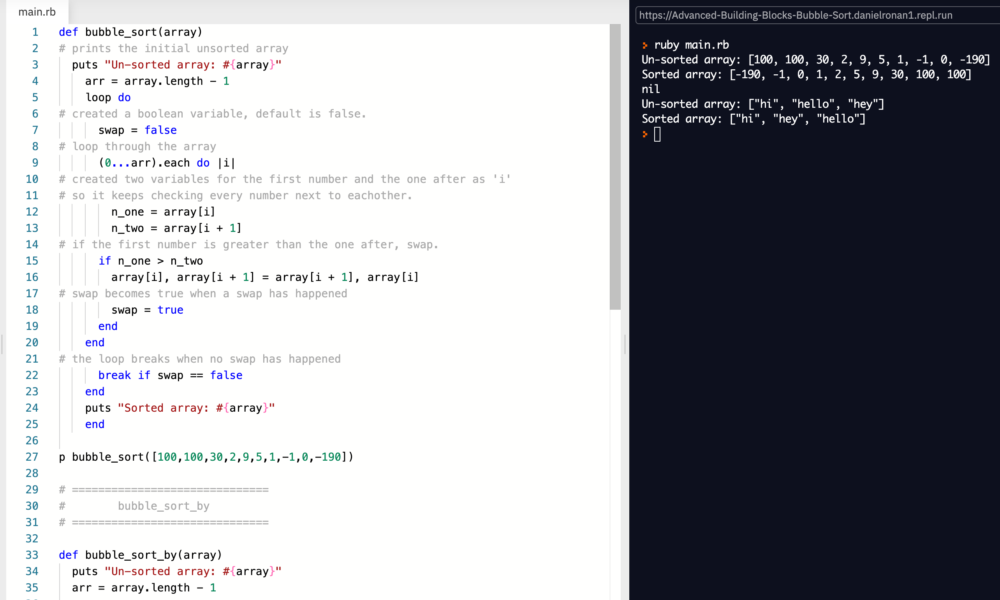

# Project 9 - Advanced Building Blocks - Bubble Sort

## Library Directory
 
| Contents        |
| ------------- |
| [Built With](#built-with) |
| [Live Demo](#live-demo) |
| [Run Tests](#run-tests) |
| [Authors](#authors) | 
| [License](#license) | 

## Description
> In this project we had to create two bubble_sort algorithms.




You can access the live demo by scrolling down to it's section.

## Built With
```
- Ruby
- VS Code
- Repl
```

## Live Demo

#### Click on the button below..

[](https://repl.it/@DanielRonan1/Advanced-Building-Blocks-Bubble-Sort)

## Run Tests

### Run
```
Click 'Run' on repl.it
```

## Authors

### 👩‍💻 Losalini Rokocakau
[](https://github.com/DcRonan) <br>
[](https://www.linkedin.com/in/danronan10/) <br>
[](mailto:danielconnorronan@gmail.com) <br>
[](https://twitter.com/dc_ronan)

### 👨‍💻 Daniel Ronan

[](https://github.com/chelmerrox) <br>
[](https://www.linkedin.com/in/losalini-rokocakau)

### 🤝 Contributing

Contributions, issues and feature requests are welcome!

Feel free to check the [issues page](enter issues url here).

### Show your support

Give a ⭐️ if you like this project!

### Acknowledgments

- Inspiration

### License


